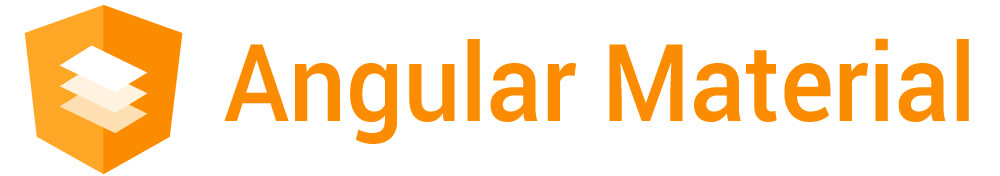

# AngularMaterial

This project was generated with [Angular CLI](https://github.com/angular/angular-cli) version 17.1.3.

## Development server

Run `ng serve` for a dev server. Navigate to `http://localhost:4200/`. The application will automatically reload if you change any of the source files.

## Code scaffolding

Run `ng generate component component-name` to generate a new component. You can also use `ng generate directive|pipe|service|class|guard|interface|enum|module`.

## Build

Run `ng build` to build the project. The build artifacts will be stored in the `dist/` directory.

## Running unit tests

Run `ng test` to execute the unit tests via [Karma](https://karma-runner.github.io).

## Running end-to-end tests

Run `ng e2e` to execute the end-to-end tests via a platform of your choice. To use this command, you need to first add a package that implements end-to-end testing capabilities.

## Further help

To get more help on the Angular CLI use `ng help` or go check out the [Angular CLI Overview and Command Reference](https://angular.io/cli) page.

## Further information

- `npm install -g @angular/cli`
- `npm ci`

- `https://material.angular.io/`
- `https://material.io/`
  - Specification: Material 3 is the latest version of Google’s open-source design system.
- `ng new angular-material`
- `https://fonts.google.com`
- `https://fonts.google.com/icons`

- `https://github.com/FiloSottile/mkcert`

## Content

| Tag name | Branch name                         | Description                             |
|----------|-------------------------------------|-----------------------------------------|
| 1        | main                                | Main branch                             |
| 2        | navigation-and-container-components | Navigation and Container Components     |
| 3        | dialogs                             | Angular Material Dialogs                |
| 4        | advanced-features                   | Angular Material Advanced Features      |
| 5        | responsive-design                   | Responsive Design With Angular Material |
| 6        | tree-component                      | Angular Material Tree Component         |
| 7        | virtual-scrolling-and-custom-themes | Virtual Scrolling and Custom Themes     |
| 8        | theming-and-elevation               | Theming and Helpers                     |
| 9        | other                               | Other Angular Material stuff            |
| 10       | master                              | Production-ready Website                |

## Images

